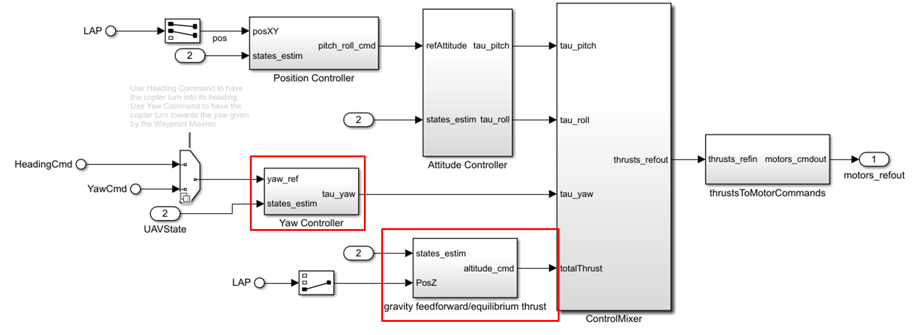
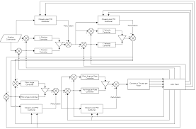
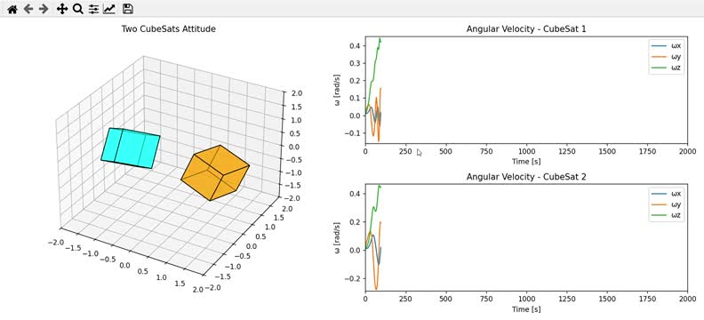

# CubeDynamics

**Modular Hardware-in-the-Loop (HIL) CubeSat Simulation Platform**

A professional-grade web-based simulation platform for CubeSat attitude dynamics and control, built with React, TypeScript, and React Three Fiber.
## Features
- **Separated Architecture**: Physics Engine and Flight Computer (OBC) are completely decoupled
- **Real-time 3D Visualization**: Interactive CubeSat model with attitude representation
- **Advanced Control**: EKF state estimation and PID control implementation
- **Professional UI**: Dark "Mission Control" aesthetic with real-time telemetry charts
- **HIL Simulation**: Accurate sensor noise, packet loss, and disturbance injection

## Tech Stack

- **Framework**: React 18+ with TypeScript
- **Build Tool**: Vite
- **3D Graphics**: React Three Fiber & Drei
- **Charts**: Recharts
- **State Management**: Zustand
- **Styling**: Tailwind CSS
- **Icons**: Lucide React

## Getting Started

### Installation

```bash
npm install
```

### Development

```bash
npm run dev
```

Visit `http://localhost:3000` to see the simulation.

### Build

```bash
npm run build
```

## Architecture

### Core Components

1. **PhysicsEngine.ts**: Simulates rigid body dynamics using quaternions and Euler's equations
2. **FlightComputer.ts**: Implements EKF for state estimation and PID control
3. **SimulationLoop.ts**: Main simulation loop running at 60fps, bridges physics and control

### UI Components

- **SatVisualizer**: 3D CubeSat model with attitude visualization
- **TelemetryStream**: Real-time scrolling charts for attitude and torque
- **ControlPanel**: PID tuning and system configuration
- **StatusPanel**: Live telemetry readouts
- **LogConsole**: System event logging

## Features

### Physics Simulation

- Quaternion-based attitude representation (no gimbal lock)
- Rigid body dynamics integration
- Disturbance torque injection
- Reaction wheel control simulation

### Flight Computer

- Extended Kalman Filter (EKF) for state estimation
- PID controller with anti-windup
- Sensor noise simulation
- Control torque saturation

### User Interface

- Start/Stop/Reset controls
- Real-time fault injection
- PID gain tuning
- Target attitude setting
- LoRa link status monitoring
- Packet loss simulation

---

## MATLAB & Simulink

The project includes a complete MATLAB/Simulink implementation in the `matlab/` directory, mirroring the web simulation for offline analysis, parameter tuning, and academic validation.

### MATLAB Quick Start

```matlab
cd matlab/
CubeSat_Main   % Runs full simulation and generates plots
```

### Simulink Quick Start

```matlab
cd matlab/
CubeSat_Simulink_Init    % Load workspace parameters
CubeSat_Simulink_Setup   % Build the Simulink model
sim('CubeSat_Simulink')  % Run simulation
```

### MATLAB Files

| File | Description |
|------|-------------|
| `CubeSat_Main.m` | Main simulation script (60 Hz loop + plotting) |
| `PhysicsEngine.m` | Rigid body dynamics (Euler's equations + quaternions) |
| `FlightComputer.m` | EKF state estimation + PID control |
| `QuatToEuler.m` | Quaternion → Euler conversion |
| `QuatMultiply.m` | Quaternion multiplication |
| `PlotResults.m` | Publication-quality result plots |
| `CubeSat_Simulink_Setup.m` | Programmatic Simulink model builder |
| `CubeSat_Simulink_Init.m` | Simulink workspace initialization |

See [`matlab/README.md`](matlab/README.md) for full documentation.

---

## Project Gallery & Image Analysis

Here are the visual analyses of the key project images:

### PID Autotuning Multirotor Example

*Analysis*: This image showcases the PID autotuning response for multirotor dynamics, highlighting the controller's ability to achieve stable attitude control under simulated conditions.

### System Visualization


*Analysis*: An overview of the system's structural or logical representation, illustrating the core components.

### Hardware / Simulation Interface
.jpg)

*Analysis*: Displays the hardware components or simulation interface integration relevant to the hardware-in-the-loop setup.

### Simulation Output Still


*Analysis*: A direct capture from the active simulation, demonstrating the real-time visual output of the CubeSat reaction wheel self-balancing algorithm.

---

## Team & Contributors

This project was built collaboratively by the following team:

| Role | Name | GitHub |
|------|------|--------|
| 👑 Team Leader — System Architecture & Embedded HIL Integration | ARYA M G C | [@ARYA-mgc](https://github.com/ARYA-mgc) |
| ⚙️ Control Systems & Attitude Dynamics | Ashwin R | [@ashwinr-act-cit](https://github.com/ashwinr-act-cit) |
| 💻 Simulation Framework & Software Development | Nithivalavan N | [@Nithi-tech](https://github.com/Nithi-tech) |
| 🔧 Hardware Design & Power Systems | Jayaraj M | [@jayarajMd](https://github.com/jayarajMd) |
| 📡 Telemetry & Communication Interfaces | Vishal Meyyappan R | [@vishal-r07](https://github.com/vishal-r07) |

### Collaborators

- [@ARYA-mgc](https://github.com/ARYA-mgc) — System Architecture & Embedded HIL Integration
- [@ashwinr-act-cit](https://github.com/ashwinr-act-cit) — Control Systems & Attitude Dynamics
- [@Nithi-tech](https://github.com/Nithi-tech) — Simulation Framework & Software Development
- [@jayarajMd](https://github.com/jayarajMd) — Hardware Design & Power Systems
- [@vishal-r07](https://github.com/vishal-r07) — Telemetry & Communication Interfaces

---

## License

MIT License
